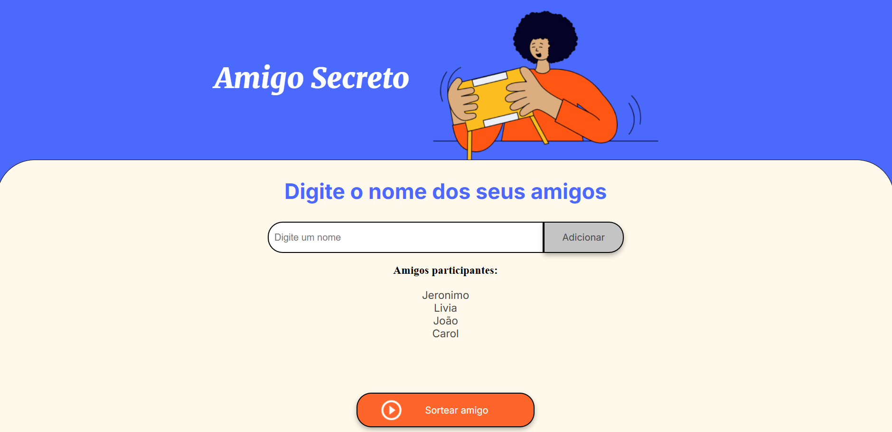
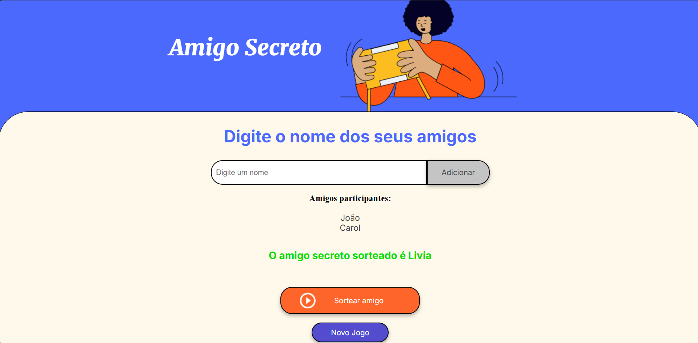
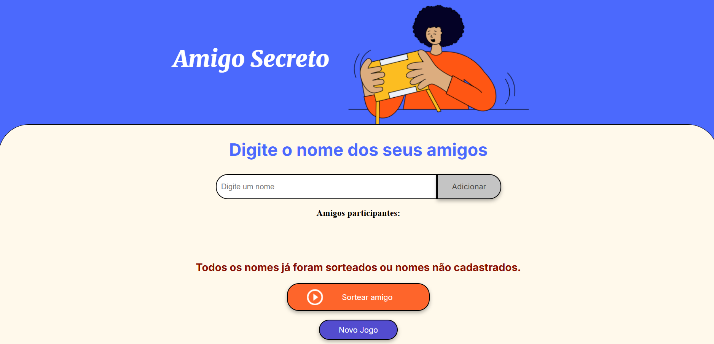
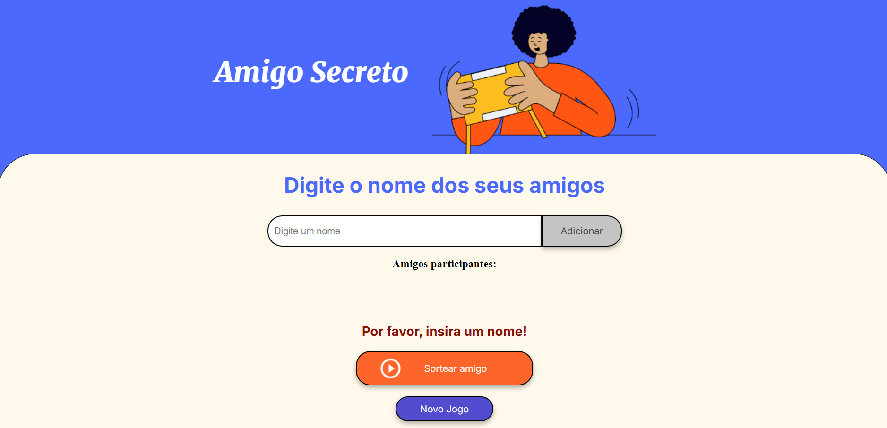

# Alura Challenge - Amigo Secreto

Este repositório contém a solução para o desafio "Amigo Secreto" proposto pela Alura, desenvolvido com HTML, CSS e JavaScript.

## Descrição
O projeto simula o sorteio de um amigo secreto, onde cada participante é associado aleatoriamente a outro. A aplicação foi criada para aprimorar habilidades em JavaScript e manipulação de DOM.

## Tecnologias Utilizadas
- HTML
- CSS
- JavaScript

## Como Usar
1. Clone este repositório ou faça o Download ZIP.
2. Abra o arquivo `index.html` em seu navegador.
3. Digite o nome e clique em adicionar para criar uma lista de amigos participantes.
4. Use a funcionalidade de sorteio para ver os resultados.

## Principais Funcionalidades
- Verifica se o campo digitado é válido.
- Verifica se já contém o nome na lista para não adicionar nomes duplicados.
- Quando amigo é sorteado ele é removido da lista para não ser escolhido novamente.
- Ao chegar ao final da lista e você clica em "Sortear amigo", ele exibe uma mensagem dizendo que todos amigos já foram sorteados.
- Foi adicionado um botão "Novo Jogo".

## Faça o teste sem baixar
Foi feito um deploy da aplicação no Vercel. Para testar basta acessar o link a seguir:
https://alura-challenge-amigo-secreto.vercel.app/

## Contribuição
Se desejar contribuir com melhorias, crie uma branch, faça suas alterações e envie um pull request.

## Licença
Este projeto está licenciado sob a [MIT License](LICENSE).

## Screenshots

